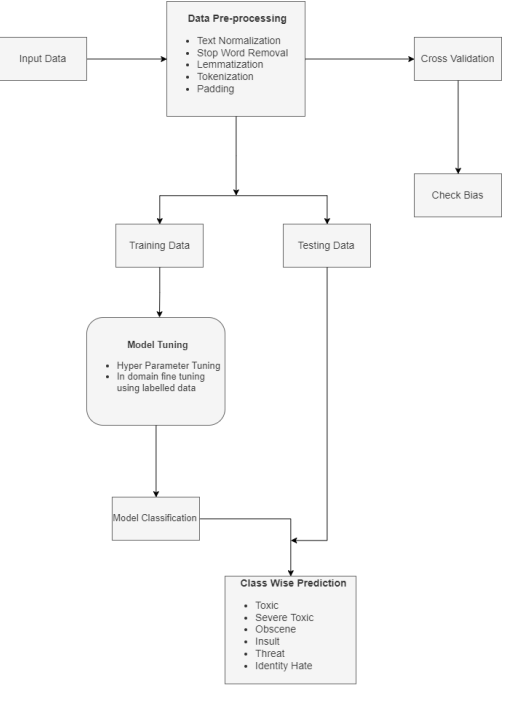

# MULTILINGUAL TOXIC COMMENT CLASSIFICATION

## PROJECT OVERVIEW

We intend to create a multilingual toxic text classifier to determine all the toxic
comments on various social media platforms including hate, abusive, obscene, threat and
insulting comments through a dataset where the samples are composed of various
languages. Most of the existing models are trained using one language, as in the dataset
with more than one language there are many problems while writing the ML Algorithms
as the first part of every model is to detect the language and identify/classify the words as
toxic or non-toxic. Although these approaches address some of the task's challenges the
remaining ones still remain unsolved and directions for further research work is needed.
We present our dataset collection and annotation process, where we aim to select
candidates covering multiple demographic groups. Further on, we compare some of the
deep learning and shallow approaches on a new, large comment data-set and introduce an
ensemble that outperforms all individual models

## PROBLEM STATEMENT

These days, most people make use of online communication on a daily basis. But
sometimes, while communicating with other people, some people resort to rude or vulgar
comments to intimidate or threaten others. This can prevent people from being peaceful
and also reduce their productivity online. People might not feel free to express their ideas
in fear of these toxic comments. We intend to make this project with the aim to determine
all the toxic comments on social media including hate, abusive, obscene, threat and
insulting comments in a dataset where the entries are stored in more than one language.
We plan to focus on multiple deep learning models which can identify and classify such
toxic comments in online conversations and flag them as categories of Toxic,Severe
toxic,Obscene,Threat,Insult and Identity Hate. Identification of such comments will allow
for the smooth functioning of online activities

## SCOPE OF THE PROJECT

The rapid growth of the internet has resulted in a large number of people using the
internet for online communication, sharing information, etc. All of these diverse cultures
have many things in common, such as political views, religion, economy, and even their
favorite singer or actress, and because of these differences, individuals begin to act
impulsively and fight online. People tend to be more rude while using online social media
sites as they have the ability to remain completely anonymous and invisible behind the
computer screen. The main objective of the project is to determine all the toxic comments
on social media including hate, abusive, obscene, threat and insulting comments in a
dataset where the entries are stored in more than one language. We made this project to
focus on various deep learning models which can identify and classify the toxicity
content in online conversations and flag them as categories of Toxic,Severe
toxic,Obscene,Threat,Insult and Identity Hate .If these comments could be identified that
would lead to safer and more collaborative threads.

## PROJECT WORKFLOW

### PROPOSED ARCHITECTURE:

### DATA FLOW:

Division of the current work of literature surveys and code has been done equally between all of us in the following way:
Each one of us have taken up one papers from the given list of papers and prepared a literature survey on the same.  Once the papers are assigned, We read and understand the content of the paper thoroughly and then prepare a summary of the same. This summary provided include the objective of the paper, the model used, data source, evaluation method, and accuracy.
Overall, this division of work ensures that each of us get an opportunity to work on all the aspects of the project. Additionally, this approach allows us to work on different models, which will provides us with an opportunity to learn more and develop expertise in a particular model. Moreover, by sharing our work and collaborating with others, we can learn from each other and develop strong teamwork skills.

### INPUT DATASET
We use the Kaggle dataset published by Google Jigsaw. This dataset includes 153,164
instances with six labels, namely, toxic, obscene, severe toxic, insult, threat, and identity
hate. These labels are used to define the level of toxicity in an instance and can
determine if it is toxic or non-toxic.
LINK: (https://https://www.kaggle.com/datasets/koheishima/jigsaw-toxic-comment-dataset)

## SYSTEM REQUIREMENTS:

**Operating System:** Windows/ Mac OS/ Linux  
**RAM:** 4GB and above  
**CPU:** Ryzen 5  
**Browsing Environment:** Firefox 27.0/ Chrome 20.0/ Brave 1.0 and later.  

## TECHNICAL DETAILS

Long short-term memory is an artificial neural network used in the fields of artificial 
intelligence and deep learning. Unlike standard feedforward neural networks, LSTM has 
feedback connections. Such a recurrent neural network can process not only single data 
points, but also entire sequences of data.

**GRU**( Gated Recurrent Unit) is a variant of the standard RNN( Recurrent neural
network).GRUs are very similar to Long Short Term Memory(LSTM) and employ a gated process
to control and manage the flow of information between cells in the neural networks. But
unlike LSTM which uses three gates, GRUs use two gates, which are reset and
update.The Reset Gate is responsible for the short-term memory of the network and the
update gate is responsible for long-term memory.GRU models are relatively new when compared to LSTM. They thus have a simple
architecture and offer some improvement over LSTM.

A common structure for long short term memory (LSTM) is composed of a memory cell,
an entry gate, an output gate and a forget gate. The cell saves a value for either small, or
long periods of time. That is accomplished by way of using activation feature for the
memory cells. Convolutional neural network (CNN) makes an efficient use of layers with
convolving filters which are applied to local capabilities. The CNN LSTM structure
involves the usage of CNN layers for function extraction on enters data joined with
LSTM to support series prediction. This structure changes referred to as a long-term
recurrent convolutional network or lrcn version

A **QRNN**, or Quasi-Recurrent Neural Network, is a type of recurrent neural network that
alternates convolutional layers, which apply in parallel across timesteps, and a minimalist
recurrent pooling function that applies in parallel across channels.
QRNN tends to the disadvantages of both the standard architectures. It permits equal
handling and catches long haul conditions like CNN, and furthermore permits the result
to rely upon the request for tokens in the succession like RNN. Due to the expanded
parallelism, it very well may be upto multiple times quicker at preparing and testing than
LSTM

**BERT** stands for **Bidirectional Encoder Representations for Transformers**. It has been
pre-trained on Wikipedia and BooksCorpus and requires task-specific fine-tuning. It is a
multi-layer bidirectional Transformer encoder. We are using BERT base – 12 layers
(transformer blocks), 12 attention heads, and 110 million parameters. BERT
performs-Masked Language Modeling and Next Sentence Prediction.

## ABSTRACT
We intend to create a multilingual toxic text classifier to determine all the toxic comments on various social media platforms including hate, abusive, obscene, threat and insulting comments through a dataset where the samples are composed of various languages. Most of the existing models are trained using one language, as in the dataset with more than one language there are many problems while writing the ML Algorithms as the first part of every model is to detect the language and identify/classify the words as toxic or non-toxic. Although these approaches address some of the task's challenges the remaining ones still remain unsolved and directions for further research work is needed. We present our dataset collection and annotation process, where we aim to select candidates covering multiple demographic groups. Further on, we compare some of the deep learning and shallow approaches on a new, large comment data-set and introduce an ensemble that outperforms all individual models.

## BACKGROUND
With the increasing use of social media platforms, online communication has become an important part of people’s internet experience. But sometimes, while communicating with other people, some people resort to rude and vulgar comments to intimidate or threaten others. This form of bullying and harassment on social media sites may lead people to stop expressing themselves, and they may even get depressed. There have been many attempts made to come up with an intelligent and efficient model which can detect these toxic and rude comments.

The objective is to use machine learning/deep learning models that can identify toxicity in these conversations. If the toxicity content could be identified, we could ensure a safer community of online communication and avoid all sorts of cyberbullying. Most of the approaches to toxic comment classification involve some form of machine translation from source language in which the model is trained on to a particular target language. But there is a limitation while trying to explore the combined topic of multilingual toxic text classification.

## OBJECTIVE
The rapid growth of the internet has resulted in a large number of people using the internet for online communication, sharing information, etc. All of these diverse cultures have many things in common, such as political views, religion, economy, and even their favourite singer or actress, and because of these differences, individuals begin to act impulsively and fight online. People tend to be more rude while using online social media sites as they have the ability to remain completely anonymous and invisible behind the computer screen.

The main objective of the project is to determine all the toxic comments on social media including hate, abusive, obscene, threat and insulting comments in a dataset where the entries are stored in more than one language. We made this project to focus on various deep learning models which can identify and classify the toxicity content in online conversations and flag them as categories of Toxic, Severe toxic, Obscene, Threat, Insult and Identity Hate .If these comments could be identified that would lead to safer and more collaborative threads.

## PROBLEM DEFINITION
These days, most people make use of online communication on a daily basis. But sometimes, while communicating with other people, some people resort to rude or vulgar comments to intimidate or threaten others. This can prevent people from being peaceful and also reduce their productivity online. People might not feel free to express their ideas in fear of these toxic comments. We intend to make this project with the aim to determine all the toxic comments on social media including hate, abusive, obscene, threat and insulting comments in a dataset where the entries are stored in more than one language.

We plan to focus on multiple deep learning models which can identify and classify such toxic comments in online conversations and flag them as categories of Toxic, Severe toxic, Obscene, Threat, Insult and Identity Hate. Identification of such comments will allow for the smooth functioning of online activities.

## INPUT/OUTPUT
### Input
Comments

### Output
Identify toxicity and categorizing them into:  

**Toxic**  
**Severe Toxic**  
**Obscene**    
**Threat**  
**Insult**  
**Identify Hate**

## MODULES AND DESCRIPTION
### DATA EXPLORATION
We will use the Jigsaw dataset which consists of 160k human labeled comments from Wikipedia talk page. The Data exploration will help us to understand the labelling, tendencies in the corpus and missing, incomplete values of the dataset.

### EXPLORATORY VISUALIZATION
It will give us a deeper understanding of the dataset, giving an insight into issues such as class imbalance, multi-tagging and correlation. Factors such as comments length distribution and word frequency to be explored.

### DATA PRE-PROCESSING
We apply various techniques of data pre-processing to enhance features in the corpus along with removal of redundant words. Text Normalization will be the first major task in the pre-processing step and it will ensure a corpus with relevant characters and words. Lemmatization helps transform our corpus in a dictionary of root words allowing for removal of multiple variations of the same word . Stop word removal is used to remove the words with high frequencies in the corpus which add no value to the prediction/classification. This was along with the spacy library with the standard stop-words dictionary being removed.

### TOKENIZATION
After pre processing we apply Tokenization which allows us to experiment with various bags of word models and involves transforming textual data to numerical data which can be fed into the model. Normalizations such as padding and one hot encoding are also performed to further increase prediction capabilities of the model to be trained.

### CROSS VALIDATION
Cross-validation gives a more accurate measure of model quality, However, it can take more time to run, because it estimates models once for each fold.We are using this so to check the biases in the test and train data, as it could results in better accuracy and results of our model.

### HYPER TUNING PARAMETER
Hyperparameter tuning is used to optimize a single target variable, also called the hyperparameter metric, that is specified. The accuracy of the model is calculated from an evaluation pass, and is a common metric. The metric is supposed to be a numeric value, and it can be specified whether we want to tune the model to maximize or minimize the metric.

### MODEL CLASSIFICATION
We use different deep learning models with different architectures for classification. These models identify the toxic comments and the extent of toxicity by flagging them into categories of Toxic, Severe toxic, Obscene, Threat, Insult and Identity Hate.

### MODEL EVALUATION
When working with machine learning models, it is essential to evaluate their performance based on various metrics to understand their effectiveness. In this markdown, we will discuss the evaluation methods and results of different models used in various research papers related to the classification of toxic comments.

## LITERATURE SURVEYS:
### Paper 1: Multilingual Toxic Comment Detection
**Authors:** Ranasinghe, T., Zampieri, Hettiarachchi  
**Objective:** To detect multilingual toxic comments using neural networks.    
**Model Used:** LSTM, GRU, BERT  
**Data Source:** HASOC dataset containing posts from Twitter and Facebook in German, English, and code-mixed Hindi.  
**Evaluation Method:** F1-Score  
**Accuracy:** N/A  

### Paper 2: Classification of Online Toxic Comments
**Authors:** Rahul; Harsh Kajla; Jatin Hooda; Gajanand Saini    
**Objective:** Classification of online toxic comments using ML algorithms.  
**Model Used:** Logistic Regression, Naive Bayes, Decision Tree, Random Forest, KNN  
**Data Source:** Dataset from Kaggle    
**Evaluation Method:** Hamming loss, log loss, Accuracy  
**Accuracy:** Logistic Regression: 89.5% Naive Bayes:86.5% Decision Tree:** 86.7% Random Forest: 85.6% KNN: 87.1%  

### Paper 3: Toxic Comment Classification using Neural Networks
**Authors:** Revati Sharma, Meetkumar Patel  
**Objective:** Toxic comment classification using neural networks and machine learning.  
**Model Used:** CNN, RNN, LSTM  
**Data Source:** Kaggle dataset and Wikipedia  
**Evaluation Method:** Accuracy, Time Performance  
Accuracy: CNN: 98.01% RNN: 98.8% LSTM: 98.4%  

### Paper 4: Feature Extraction for Prediction Model
**Authors:** Chandrika CP & Jagadish  
**Objective:** Extracting features to obtain a prediction model by applying gradient boosting.  
**Model Used:** Logistic Regression, LSTM, Gradient Boosting, Naive Bayes, Random Forest  
**Data Source:** Kaggle's dataset containing 1.6 Lakh comments for training and 6000 comments for testing.  
**Evaluation Method:** Accuracy  
**Accuracy:** Logistic Regression: 67.9% LSTM: 97.8% Gradient Boosting: 69.7% Naive Bayes: 60.4% Random Forest: 66%  

### Paper 5: Multi-Label Word Embeddings Approach
**Authors:** Salvatore Carta, Andrea Corriga, Riccardo Mulas et al  
**Objective:** Used multi-label word embeddings approach for the classification of toxic comments.  
**Model Used:** NLP, CNN  
**Data Source:** Comments from Wikipedia Talk page  
**Evaluation Method:** Word Embeddings   
**Accuracy:** N/A  

## GAPS IN LITERATURE

When we select some random comments,they must be translated into another language, such as German, before being translated back into English. The meaning of those statements may be distorted as a result of this conversion. Simultaneously, the size of the training data set grows. During the processing and cleansing of the data in [8,] some information was lost. New features, such as the number of grammatical errors, the length of the comment, the amount of profane phrases, and so on, can be added, however this alters the training time compilation. In many state-of-the-art models, the models incorrectly learnt to correlate the names of often assaulted individuals with toxicity in numerous state-of-the-art procedures. Even when the remarks containing those identities (e.g. "gay") were not toxic (e.g. "I am a gay woman"), the models predicted a high risk of toxicity. This occurs because training data was gathered from publicly available sources, where some identities are frequently alluded to in derogatory terms. When a model is trained from data with these imbalances, it runs the danger of merely reflecting those biases back to consumers.

